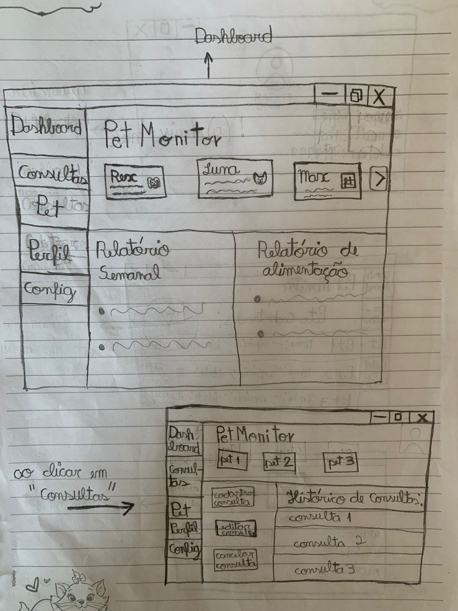
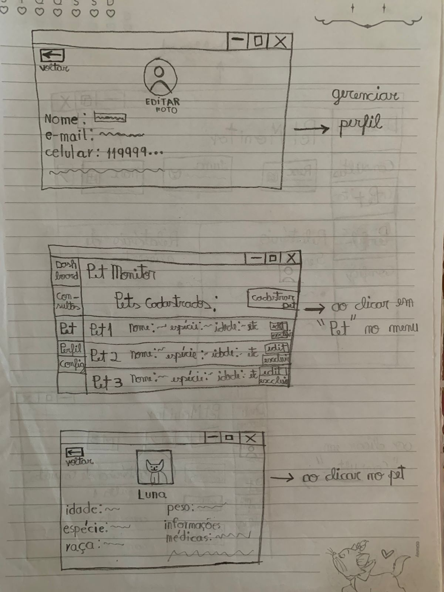
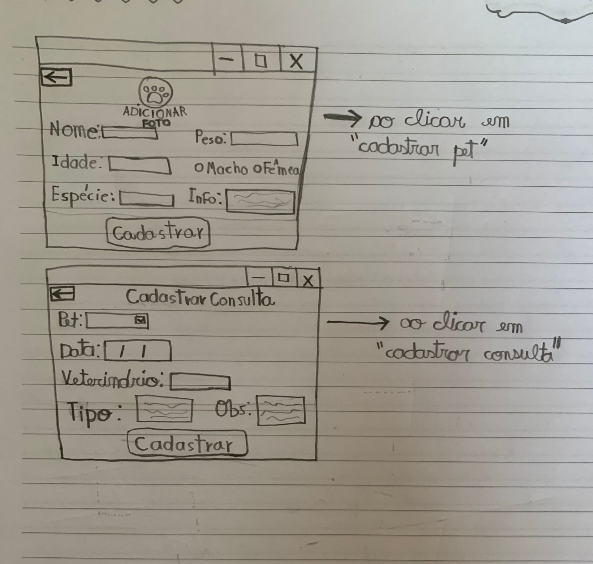

# **PetMonitor:** Sistema de Monitoramento de Animais de Estimação

Trabalho de Experiencia do Usuário (UX) apresentado ao Centro Universitário [FEI](https://portal.fei.edu.br/), como parte dos requisitos necessários para aprovação na disciplina de Experiência do Usuário e Front-End (CCP310) do curso de Ciencia da Computação, orientado pelo Prof. Dr. [Fagner de Assis Moura Pimentel](https://github.com/fagnerpimentel).

## Componentes do Grupo

- João Vitor Alves Escudeiro 24.224.010-9
- Isabela Bonoto de Castro 24.224.008-3

## Resumo

- O sistema desenvolvido tem como objetivo auxiliar o usuário no acompanhamento da saúde e rotina de seus animais, a partir de funções como cadastro de usuários e pets, registro de vacinas e consultas, dashboard com lembretes e configuração de alertas.

## Introdução

- O site é uma boa solução para pessoas que não possuem uma forma eficiente de monitorar as diversas necessidades de seus animais de estimação.
- A partir de certas funções disponíveis no site, o monitoramento do seu animal de estimação se torna muito mais fácil.
- O site terá uma interface fácil de entender e interagir, proporcionando ao usuário uma experiência intuitiva e confiável, para que ele possa realizar as funções da melhor forma.

## Publico Alvo

- Donos de pets.
- Pessoas que trabalham com animais (petsitters, veterinários).

## Personas
### Persona primária 1:

**Nome:** Carla Mendes  
**Idade:** 34 anos  
**Profissão:** Analista de Marketing Digital  
**Localização:** Belo Horizonte, MG  
**Pet:** Cachorro (Golden Retriever) de 3 anos  
**Comportamento digital:**  
Usa aplicativos diariamente, principalmente no celular.  
**Necessidades:**  
Lembrar das datas de vacinação e consultas.  
Ter um histórico de saúde do pet acessível em um só lugar.  
Receber notificações de rotina (banho, vermífugo, etc).  
**Problemas a solucionar:**  
Costuma esquecer as datas das vacinas.  
Acha difícil organizar os cuidados com o pet em meio à rotina corrida.  
**Objetivos com o sistema:**  
Facilitar o monitoramento da saúde e bem-estar do seu pet.  
Sentir-se segura de que está cumprindo com todas as responsabilidades de tutora.  

### Persona primária 2:
**Nome:** Henrique Lima  
**Idade:** 22 anos  
**Profissão:** Estudante de Engenharia  
**Localização:** São Paulo, SP  
**Pet:** Gato filhote (adotado recentemente)  
**Comportamento digital:**  
Usa bastante o celular, navega por apps e jogos.  
**Necessidades:**  
Aprender o que é necessário para cuidar do pet.  
Ter lembretes automáticos sobre vacinação e alimentação.  
**Problemas a solucionar:**  
Falta de informação centralizada sobre os cuidados do animal.  
Medo de esquecer algo importante por inexperiência.  
**Objetivos com o sistema:**   
Ter uma espécie de "guia digital" para cuidar bem do pet.  
Criar uma rotina mais organizada com o novo animal.  

### Persona primária 3:
**Nome:** Luciana Torres  
**Idade:** 47 anos  
**Profissão:** Médica Veterinária  
**Localização:** Recife, PE  
**Pet:** 4 cachorros, 2 gatos e 2 peixes

**Comportamento digital:**  
Usa o computador e celular para fins profissionais e pessoais.  
**Necessidades:**  
Organizar a rotina de vários pets ao mesmo tempo.  
Armazenar e visualizar histórico de saúde de cada animal.  
**Problemas a solucionar:**  
Ter que usar várias ferramentas diferentes para organizar informações.  
Dificuldade em manter tudo atualizado para todos os pets.  
**Objetivos com o sistema:**  
Centralizar as informações em uma única plataforma.  
Automatizar lembretes e alertas.  

### Persona secundária:
**Nome:** Patrícia Gomes  
**Idade:** 30 anos  
**Profissão:** Pet Sitter (babá de pets)  
**Localização:** Curitiba, PR  
**Pet:** Não possui pets próprios, cuida dos pets de clientes  
**Comportamento digital:**  
Usa celular para agendar serviços e se comunicar com os clientes.  
**Necessidades:**  
Organizar a agenda de cuidados com vários pets de clientes.  
Ter acesso fácil às informações específicas de cada pet.  
**Problemas a solucionar:**  
Depender de anotações físicas ou informações passadas de forma desorganizada pelos donos.  
**Objetivos com o sistema:**  
Acompanhar a rotina dos pets que cuida, mesmo que não sejam seus.  

### Persona negativa:
**Nome:** Carlos Henrique  
**Idade:** 40 anos  
**Profissão:** Caminhoneiro  
**Localização:** Goiânia, GO  
**Pet:** Cachorro (vira-lata) de 5 anos  
**Comportamento digital:**  
Usa pouco a internet e não gosta de tecnologia.  
**Motivo de não ser foco:**  
Não tem interesse em usar aplicativos ou sistemas para organização.  
Acha desnecessário esse tipo de monitoramento.  
Prefere métodos tradicionais ou não faz controle nenhum da saúde do pet.  
**Objetivos com o sistema:**  
Nenhum, não é um usuário-alvo.  

- O serviço irá guardar informações de identificação do usuário, como cpf, nome completo e contatos, e dados importantes sobre seus pets, como nome, idade, espécie, peso e histórico da saúde e vacinação do animal.

### Mapa de empatia

### Mapa de Empatia — Persona Primária 1: Carla Mendes

#### - O que o usuário vê:
Vê seu pet diariamente e se preocupa com o bem-estar dele.  
Enxerga uma rotina corrida de trabalho e pouco tempo para organizar tarefas manuais.  
Utiliza bastante o celular e vê anúncios e conteúdos sobre cuidados com animais nas redes sociais.  
Observa outros tutores usando apps para organização e se sente motivada a procurar soluções similares.

#### - O que o usuário ouve:
Ouve recomendações de amigos e familiares sobre clínicas veterinárias, produtos e cuidados com pets.  
Recebe alertas de aplicativos no celular que usa para trabalho e vida pessoal.  
Pode ouvir do veterinário a importância de manter um histórico de vacinas e consultas.

#### - O que o usuário diz e faz:
Diz que gosta de manter tudo organizado, mas nem sempre consegue.  
Demonstra cuidado e carinho pelo pet, e quer fazer o melhor por ele.  
Tenta anotar lembretes no celular ou agenda, mas esquece com frequência.  
Busca por soluções práticas e rápidas para o dia a dia.

#### - O que o usuário pensa e sente:
Sente culpa ao esquecer compromissos importantes para o pet, como vacinas.  
Quer garantir que o pet tenha uma vida saudável e segura.  
Pensa que a tecnologia pode ser uma aliada, mas precisa ser fácil e eficiente.  
Tem altas expectativas por soluções que economizem tempo e facilitem sua rotina.

#### - Dores:
Esquecimento de datas importantes.  
Falta de tempo para se organizar.  
Medo de perder seu pet.

#### - Ganhos:
Economia de tempo com alertas automáticos.  
Tranquilidade ao ter todas as informações do pet em um só lugar.  
Sensação de estar cumprindo bem seu papel de tutora responsável.

### Mapa de Empatia — Persona Primária 3: Luciana Torres

#### - O que o usuário vê:
Muitos aplicativos e planilhas, mas nenhum que centralize tudo.
Uma rotina cheia de compromissos, tanto profissionais quanto pessoais.
Outros tutores que usam lembretes manuais, como cadernos e planilhas.

#### - O que o usuário ouve:
Colegas veterinários e amigos recomendando aplicativos diferentes, mas que não atendem todas as suas necessidades.
Comentários sobre novas tecnologias para cuidado animal, como coleiras inteligentes e apps de monitoramento.
Clientes falando sobre problemas semelhantes na organização de informações sobre seus pets.

#### - O que o usuário diz e faz:
Reclama de ter que anotar informações em lugares diferentes.
Comenta com amigos e clientes sobre a dificuldade de organizar a rotina dos animais.
Procura soluções digitais, mas desiste rapidamente se forem complicadas.
Costuma criar planilhas manuais como forma de controle, mas acha cansativo. 

#### - O que o usuário pensa e sente:
Preocupada em manter a saúde dos pets sempre em dia.
Quer ter organização e controle, mas se sente sobrecarregada.
Acha frustrante ter que usar várias ferramentas separadas para gerenciar as informações.

#### - Dores:
Dificuldade em gerenciar informações de muitos pets de forma manual.  
Risco de esquecer instruções importantes ou confundir rotinas.  
Não da conta de organizar todos os dados manualmente.
Tempo perdido buscando informações espalhadas em cadernos e planilhas.

#### - Ganhos:
Centralizar todas as informações dos pets em um único sistema.
Receber alertas automáticos sobre vacinas, consultas e cuidados.
Facilidade para visualizar históricos de saúde.
Ganhar tranquilidade e praticidade, reduzindo a sobrecarga mental.
Ter uma plataforma intuitiva, que se adapte ao dia a dia corrido.

### Mapa de Empatia — Persona Secundária: Patrícia Gomes

#### - O que o usuário vê:
Vê vários pets ao longo do dia, cada um com necessidades e rotinas diferentes.  
Enxerga uma agenda cheia de compromissos com horários específicos.  
Utiliza o celular constantemente como ferramenta de trabalho e organização.  
Percebe a dificuldade em manter todas as informações organizadas e acessíveis rapidamente.

#### - O que o usuário ouve:
Escuta instruções detalhadas dos clientes sobre alimentação, horários, medicação e comportamentos dos pets.  
Recebe mensagens frequentes de clientes via WhatsApp com atualizações ou lembretes.  
Ouve feedbacks positivos e negativos sobre o seu serviço de cuidado com os pets.

#### - O que o usuário diz e faz:
Diz que precisa manter tudo organizado para evitar falhas nos cuidados.  
Utiliza cadernos, planilhas e o celular para anotar informações importantes.  
Mantém contato constante com os tutores para confirmar ou ajustar detalhes.  

#### - O que o usuário pensa e sente:
Sente uma grande responsabilidade por cuidar dos animais de outras pessoas.  
Pensa que um erro pode comprometer sua reputação e o bem-estar do pet.  
Deseja ser reconhecida como uma cuidadora organizada, confiável e profissional.  
Acredita que uma solução digital específica poderia facilitar seu trabalho.

#### - Dores:
Dificuldade em gerenciar informações de muitos pets de forma manual.  
Risco de esquecer instruções importantes ou confundir rotinas.  
Não da conta de organizar todos os dados manualmente.

#### - Ganhos:
Organização centralizada das informações e rotinas de cada pet.  
Maior agilidade e confiança ao executar as tarefas diárias.  
Facilidade na comunicação com os tutores.  
Profissionalização do serviço e aumento da credibilidade com os clientes.

## Contexto de uso

### Persona primária 1 - Carla Mendes

- Ambiente físico: 

Usa o serviço principalmente em casa, no celular, durante momentos de descanso ou enquanto interage com o cachorro; ou em clínicas veterinárias, acessando o histórico do pet para mostrar informações durante 
consultas. Carla mora em um apartamento de médio porte em Belo Horizonte, que possui espaço planejado para facilitar a convivência com seu cachorro, mas limitado em área externa.

- Contexto social:

Carla vive em um ambiente urbano, cercada por pessoas que também têm pets. Ela conversa frequentemente com veterinários, pet shops e outros donos de cães, valorizando recomendações sobre saúde e bem-estar 
animal. Busca segurança emocional, pois se preocupa em ser uma tutora responsável e não falhar com seu cachorro.

- Contexto ecônomico:

Mora em Belo Horizonte, onde existe um mercado forte de produtos e serviços pet.

### Persona primária 3 - Luciana Torres

- Ambiente físico:

Luciana utiliza o sistema em ambientes domésticos, como sua casa, onde cuida de seus pets, e também em ambientes profissionais, como a clínica veterinária onde trabalha. Em casa, ela precisa de um lugar calmo 
para gerenciar as informações, enquanto na clínica pode acessar os dados rapidamente pelo celular ou computador entre atendimentos. Luciana mora em uma casa espaçosa, típica de bairros residenciais de Recife, 
com uma área externa grande para acomodar seus quatro cachorros. A casa possui quintal cercado, garantindo segurança para os cães brincarem sem risco de fuga, há também um espaço interno tranquilo onde ficam os 
gatos e o aquário com os peixes.

- Contexto social:

Ela faz parte de um círculo social que valoriza fortemente o bem-estar animal. Como veterinária, tem contato diário com outros profissionais da área, além de clientes que também enfrentam dificuldades em 
gerenciar informações de saúde dos seus pets. Ela se sente responsável não apenas pelos próprios animais, mas também em dar o exemplo e indicar boas práticas aos clientes.

- Contexto ecônomico:

Luciana vive em Recife, uma cidade grande, com acesso a tecnologia e serviços modernos.

### Persona secundária - Patrícia Gomes

- Ambiente físico:

Interage com a aplicação na casa do cliente, durante os cuidados com os pets. Em casa, usa o celular para organizar a agenda e revisar informações dos animais que cuidará no dia seguinte.

- Contexto social:

Ela atua em um ambiente onde a confiança e a comunicação clara são essenciais, pois os donos querem segurança e responsabilidade, mas lida diretamente com clientes que têm agendas cheias e muitas vezes passam 
informações incompletas sobre seus pets. Faz parte de grupos online de pet sitters, onde compartilham dicas e experiências.

- Contexto ecônomico:

Mora em Curitiba, cidade urbana, com uma grande demanda por serviços pet, principalmente de famílias que passam muito tempo fora de casa.

## Jornada do usuário
- A jornada começa com o cadastro e configuração inicial, se desenvolve com o acompanhamento diário da saúde e rotina de bem-estar, inclui alertas preventivos e termina com o registro e atualização do histórico de saúde.
  
### Persona primária 1 - Carla Mendes
1. Carla abre o site em seu navegador.
2. Realiza seu cadastro pessoal.
3. Realiza o cadastro de seu cachorro Dudu e adiciona as informaçõs necessárias.
4. No seu dia a dia, Carla monitora os dados de saúde e rotineiros de Dudu.
5. Certo dia, Carla recebe o alerta: "Atenção: Dudu está com a vacinação anual vencida!", então ela agenda uma consulta ao veterinário.
6. Após a vacinação, ela registra o ocorrido na aplicação. O histórico de saúde é atualizado automáticamente, mostrando qual foi a dose aplicada e quando será a próxima.

### Persona primária 3 - Luciana Torres
1. Luciana ouve falar do site na clínica e decide testar.
2. Em casa, no home office, cria uma conta. Registra os dados de todos os seus pets: vacinas, histórico médico e alimentação.
3. Ela usa o site diariamente, atualizando informações como peso e consultas e utilizando gráficos.
4. Certo dia ela nota comportamento estranho em um gato. Então consulta o histórico no site e identifica mudanças recentes. Decide se precisa levá-lo a atendimento.
5. Sente-se mais organizada e confiante. Passa a recomendar o site para clientes na clínica e amigos que têm pets.

### Persona secundária - Patrícia Gomes
1. Patrícia percebe que está confusa com tantas anotações físicas e informações desencontradas dos clientes.
2. Descobre o site com uma amiga e decide testar.
3. Cria uma conta e adiciona todos os pets. Registra informações importantes, como alimentação, horários de medicação, comportamento e vacinas.
4. Antes de sair de casa para o trabalho, acessa o app para ver a agenda do dia. Organiza os horários e locais de atendimento, evitando esquecimentos ou confusões.
5. Na casa do cliente, abre o perfil do pet no celular. Segue instruções sobre cuidados específicos: alimentação, passeios ou medicações, e registra observações no app para atualizar o cliente depois.
6. Recebe notificações durante o dia, como: “Lembrete: limpar caixa de areia da Luna!” garantindo que nenhum cuidado seja esquecido.
7. Ao chegar em casa, Patrícia revisa os atendimentos feitos.

## Análise de concorrência

- Pesquise serviços ou podutos existentes atualmente que possam realizar o objetivo deste projeto.
- Selecione pelo menos 3 serviços ou podutos diferentes.
- Em relação aos concorrentes, respondam as seguintes perguntas?
  - Existe plataforma similar que atende o mesmo mercado e funcionalidades? Se sim: Quais os pontos positivos? Quais os pontos negativos?
  - Existe plataforma diferente quanto ao serviço, mas que atenda esse mercado? Se sim: Quais os pontos positivos? Quais os pontos negativos?

## Coleta de dados
- [Formulário](https://docs.google.com/forms/d/e/1FAIpQLSdtmWC_8nNTeHDH8rb02tls6qIQwK2j44UYmbuzPtQTx4mbkQ/viewform?usp=header)
- [Roteiro de entrevista: Avaliação de usabilidade](roteirodeentrevista.pdf)
- Estudo de campo: será feita uma observação de usuários enquanto utilizam o serviço, para reparar suas dificuldades, analisando oportunidades de melhoria em sua experiência e correção de problemas notados.
  O objetivo do estudo é identificar como o sistema interfere em situações reais, e se ele realmente atende às necessidades de todos os usuários nos seus dia a dias.

- Perfil dos Participantes do estudo:

-- Tutores de pet (Persona primária 1: Carla Mendes, dona de 1 cachorro)

-- Tutores de muitos pets (Persona primária 3: Luciana Torres, dona de 4 cachorros, 2 gatos e 2 peixes)

-- Pet Sitters (Persona secundária: Patrícia Gomes, não é dona de pet, apenas cuida dos pets de clientes)

- Locais de observação:

-- Residências dos tutores – para analisar o uso do sistema na rotina doméstica.

-- Clínicas veterinárias – para avaliar como o sistema facilita a comunicação e registro de informações.

-- Durante passeios em ambientes externos – para observar interações fora de casa, como consultas rápidas ao app.

- Focos principais da análise:

-- Intuitividade e clareza na navegação.

-- Facilidade para executar tarefas principais.

-- Utilidade das notificações e lembretes.

-- Impacto do sistema na rotina de cuidados com os pets.

-- Sentimentos gerados durante a interação.

## Modelo de tarefas

## Design

- Pense nas características de Affordances do seu serviço ou poduto. 
    - Que tipo de acessibilidades devem ser consideradas dentro do seu projeto?
- Discuta o papel das expectativas do usuário no projeto deste serviço ou poduto. Qual a importância e pontos a serem considerados se você quiser vender esse serviço ou poduto?

### Prototipação em baixo nível (papel)

### Prtotipação em médio nível (Figma)
#### Avaliação heurística

### Prtotipação em alto nível (React)
#### Avaliação heurística

[^1]: Fonte: Adaptado de <https://hazeshift.com.br/mapa-de-empatia/>

